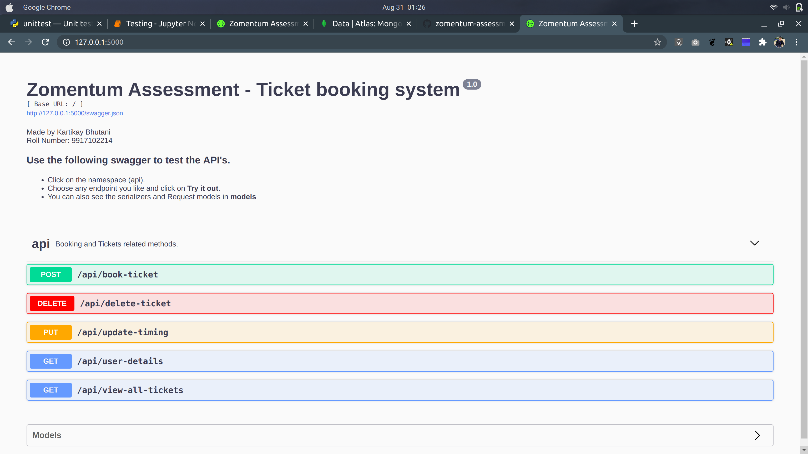
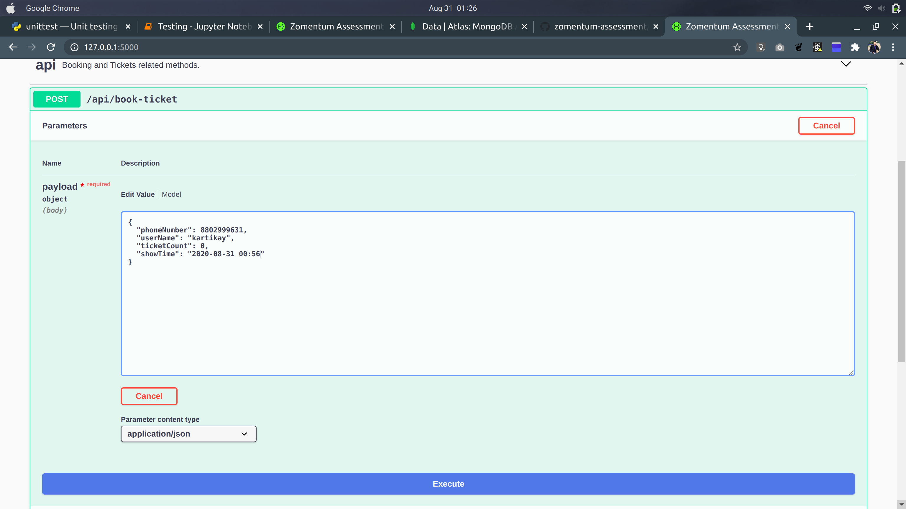
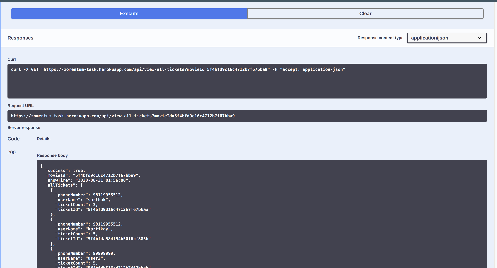
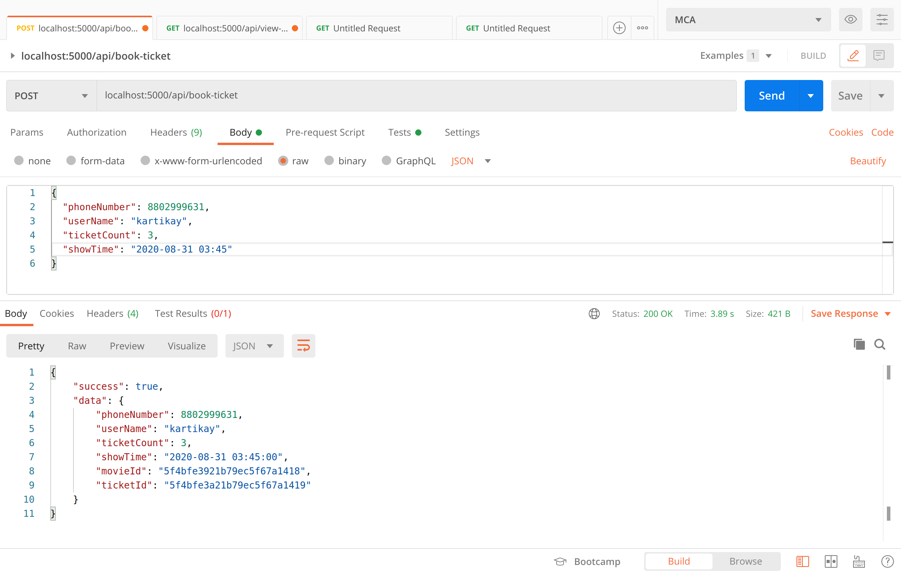
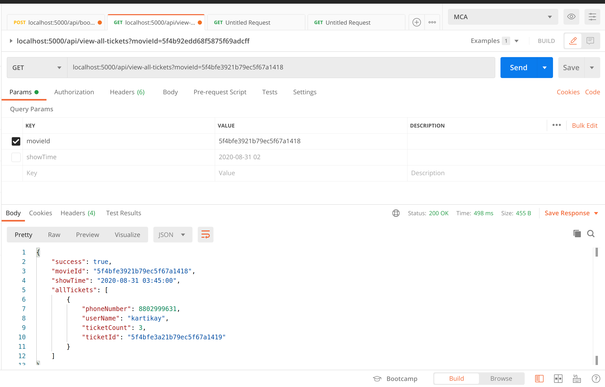

# REST API's for ticket booking system

### Deployed version - https://zomentum-task.herokuapp.com/

## Installation

The rest API's are built using 
- Python
- Flask and flask_restx
- MongoDb
 
 To set up the project locally, follow the steps below.

- Set up a virtual environment using `virtualenv .venv` and start it using `source .venv/bin/activate`
- Once that is done, use `pip install -r requirements.txt` to install all of the dependencies.
- (optional) If you want to use your own local MongoDb instance, you can replace the testing database URI with yours in `config.py`.
- (optional) If you are using local MongoDb instance, you have to run for the very first time `initDb.py` using `Python initDb.py` to initialize collections and TTL Indexes for Auto deletions of expired documents. The testing Database already has this step done.
- (optional) If you want to use authentications for all of the endpoints, you can set `apiAuth` to `True` in `config.py`. Now all of the endpoints will require the `X-Auth-Token` in their headers.
- Use `flask run` to start a server at port 5000

## API endpoints and functionalities

- #### Endpoint to Book ticket
    Post method `/api/book-ticket`  can be used to Book a ticket. If the Movie for passed show timing doesn't exists, it creates a new Movie in Movies Collection.
    Before booking the ticket, it checks for `ticketCount` which cannot exceed 20.  
- #### Update timing of ticket
    Put method `api/update-timing` can be used to update the timing of ticket.

- #### View All tickets
    Get method `/api/view-all-tickets` can be used to view all tickets booked for a movie. Either `showTiming` or `movieId` any of these can be used to check all tickets for a particular movie.

- #### Delete a ticket
    Put method `/api/delete-ticket` can be used to delete a ticket using it's `ticketId`

- #### View User Details associated with a ticket
    Get method `/api/user-details` can be used to see details of the user who booked the ticket using `ticketId`

- #### Mark Ticket Expired after 8 hours and Deletion
    This part is being handled by MongoDb **TTL index** that sets Time to live for each document. Since mongodb checks for UTC Time, the `expireAfter` time for each documents is set to 2.5 hours (8 - 5.5) since IST is ahead by 5.5 hours.
    MongoDb automatically checks for expired tickets every 1 minute and deletes the one whose `showTiming` is more than current time.

## Testing

Manual Testing can be done using the Swagger UI or Postman. For automated Unit testing, run `python test_api.py`.

### Testing through Swagger UI

You can visit https://zomentum-task.herokuapp.com/ in deployed version or `http://127.0.0.1:5000/` in locally set up version to see the Swagger UI. The endpoints for the namespace `api` are listed under it and the serializer and models are under `models`.

To test any api, select it in the swagger UI as shown in the screenshot and click `Try it now`. You can see the expected payload under `Example value` and `Model`.

To test the API and send data, Edit the values after clicking `Try it now` and enter the payload data. Once done, click `Execute` to do the request as shown in screenshot.

The `Response body, header` and `Status code` can be seen just below it.

### Testing through postman

For testing through postman, you can use this [link](https://www.getpostman.com/collections/1dd9f6ca302b465f5cfd) or use the JSON file in `Postman Collection` directory.

Sample Payload and response for few endpoints is shown below.

### Database Design

#### Collections
- movies
- tickets

#### Document Design

- movies
    - _id: Unique Movie ID
    - showTiming: Timing of the Movie
    - ticketCount: Count of tickets sold for this movie
- tickets
    - _id: Unique ticekt ID
    - movieId: Unique movie id (Reference to document in `movies` Collection)
    - showTiming: Timing of the Movie
    - userName: Userame of user
    - Phone Number: Phone number of user
    - ticketCount: Count of tickets purchased by the user

